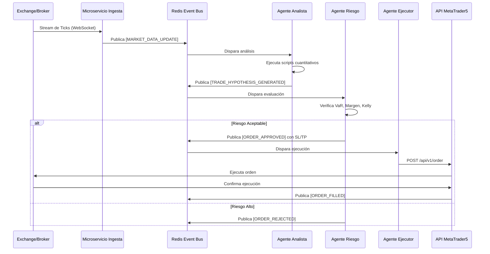

# Documento de Diseño Arquitectónico: Sistema de Trading Asíncrono Basado en Enjambres de Agentes Autónomos

## 1. Visión General
Este documento define la arquitectura técnica para un sistema de trading algorítmico 100% asíncrono y autónomo. El sistema utiliza una arquitectura basada en eventos (Event-Driven Architecture) y microservicios, operada por un enjambre de agentes de Inteligencia Artificial (LLMs configurados con roles estrictos). El objetivo es desvincular el tiempo humano de la ejecución financiera, garantizando operaciones 24/7 sin sesgos emocionales y con un estricto control de riesgo matemático.

## 2. Arquitectura de Infraestructura (Cloud-Native)
El sistema está diseñado para ser desplegado en un entorno de nube (AWS, GCP o Azure) utilizando contenedores para garantizar la inmutabilidad y la escalabilidad.

*   **Orquestación de Contenedores:** Kubernetes (K8s) o AWS ECS/Fargate para gestionar los ciclos de vida de los microservicios.
*   **Comunicación Asíncrona:** Bus de eventos (Apache Kafka o Redis Pub/Sub) para desacoplar la ingesta de datos, el razonamiento de los agentes y la ejecución.
*   **Almacenamiento de Estado:**
    *   *Time-Series Database:* InfluxDB o TimescaleDB para almacenar datos de mercado (ticks, velas).
    *   *Relational DB:* PostgreSQL para el historial de transacciones, logs de auditoría y estado financiero de la cuenta.
    *   *In-Memory Cache:* Redis para el estado en tiempo real de las posiciones abiertas y rate-limiting de las APIs.

## 3. Topología del Enjambre de Agentes (Agentic Swarm)
El núcleo inteligente del sistema utiliza un framework multi-agente (ej. **CrewAI** o **Microsoft AutoGen**). Los agentes no calculan indicadores matemáticos directamente; en su lugar, utilizan herramientas (Tools) vía **Model Context Protocol (MCP)** para invocar scripts de Python optimizados.

### Agente 1: Orquestador de Datos (Data Ingestion & Parsing)
*   **Rol:** Escuchar el flujo de datos (WebSockets de brokers, APIs de noticias).
*   **Función:** Limpiar los datos, normalizarlos y publicarlos en el Bus de Eventos.
*   **Herramientas MCP:** `fetch_historical_data`, `parse_sentiment_feed`.

### Agente 2: Analista Cuantitativo (Quant Analyst)
*   **Rol:** Consumir los datos normalizados y buscar ineficiencias o patrones (Setups).
*   **Función:** Ejecutar modelos estadísticos. No toma decisiones de compra, solo emite "Hipótesis de Trading".
*   **Herramientas MCP:** `run_backtest_module`, `calculate_volatility_bands`, `evaluate_order_book_imbalance`.

### Agente 3: Gestor de Riesgo Estricto (Risk Manager - "El Guardia")
*   **Rol:** Evaluar las Hipótesis de Trading emitidas por el Analista.
*   **Función:** Aplicar las reglas de Kelly Criterion, VaR (Value at Risk) y límites de drawdown diario. Si el riesgo excede el parámetro predefinido, el agente *rechaza* la operación ("Veto Power"). Calcula el tamaño exacto de la posición (Position Sizing) y los niveles de Stop Loss / Take Profit.
*   **Herramientas MCP:** `calculate_portfolio_exposure`, `get_current_margin`, `compute_dynamic_stop_loss`.

### Agente 4: Ejecutor de Mercado (Execution Agent)
*   **Rol:** Tomar las órdenes aprobadas por el Gestor de Riesgo y ejecutarlas en el broker.
*   **Función:** Manejar la fragmentación de órdenes (TWAP/VWAP) si es necesario, gestionar el slippage y monitorear los retornos de los webhooks del broker (Fills/Rejects).
*   **Herramientas MCP:** `place_market_order`, `place_limit_order`, `modify_position`.

## 4. Stack Tecnológico

| Componente | Tecnología Principal |
| :--- | :--- |
| **Lenguaje Core** | Python 3.11+ (asyncio, pandas, numpy, ccxt, MetaTrader5) |
| **Framework de Agentes** | CrewAI / LangChain / Claude Code |
| **LLMs Base** | Claude 3.5 Sonnet (Razonamiento complejo), GPT-4o (Fallback) |
| **Integración de Herramientas** | Model Context Protocol (MCP) |
| **Servidor de APIs / Webhooks** | FastAPI, Uvicorn |
| **Mensajería / Pub-Sub** | Redis Streams o RabbitMQ |
| **Despliegue y CI/CD** | Docker, GitHub Actions, Vercel (para dashboards frontend) |

## 5. Integración Financiera (Broker / Exchange)

El sistema requiere una capa de abstracción para comunicarse con el mundo financiero real. Esto se logra mediante un **Execution Microservice**.

*   **Para Cripto:** Integración directa vía API REST y WebSockets usando la librería `ccxt`.
*   **Para Forex/Futuros (MetaTrader 5):** Un contenedor Docker con Windows Core o Wine ejecutando el terminal MT5, exponiendo un servidor FastAPI interno que utiliza la librería `MetaTrader5` de Python.
*   **Flujo de Ejecución:**
    1. El *Execution Agent* genera un payload JSON estandarizado.
    2. Lo envía vía POST al Execution Microservice.
    3. El microservicio traduce el payload al protocolo específico del broker (REST, FIX, o MT5 API).
    4. El broker responde. El microservicio emite un evento al Bus de Mensajes: `ORDER_FILLED`, `ORDER_REJECTED`.

## 6. Diagrama de Flujo Operativo Asíncrono

## 7. Protocolos de Seguridad y "Circuit Breakers"

Al ser un sistema autónomo que maneja capital, la arquitectura de seguridad es la máxima prioridad:

1.  **Kill Switch (Hardware/Software):** Un endpoint de máxima prioridad o un botón en el dashboard de Vercel que emite una señal de pánico, forzando al Execution Microservice a cerrar todas las posiciones a mercado y detener cualquier nueva orden, ignorando a los agentes.
2.  **Límites Duros Codificados (Hard-coded Limits):** Independientemente de lo que decida el agente de riesgo (por alucinación del LLM), el microservicio de ejecución en Python tiene límites inmutables (ej. "Nunca abrir posiciones mayores a X lotes", "Nunca exceder el 2% de pérdida diaria").
3.  **Monitoreo de Salud de Agentes (Watchdogs):** Si un agente tarda más de 5 segundos en responder o entra en un loop infinito, el contenedor se reinicia automáticamente y se suspende el trading hasta la validación humana.
4.  **Aislamiento de Red:** Los agentes no tienen acceso directo a internet sin restricciones. Solo pueden comunicarse con el broker a través del Microservicio de Ejecución mediante el MCP, evitando fugas de API Keys.